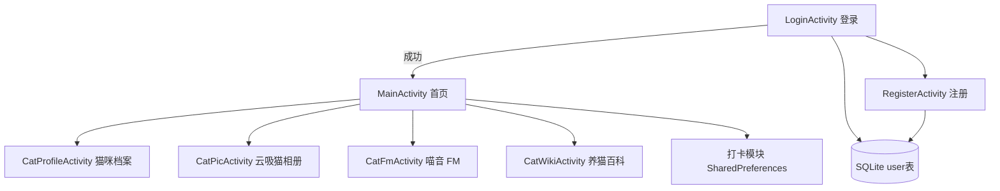
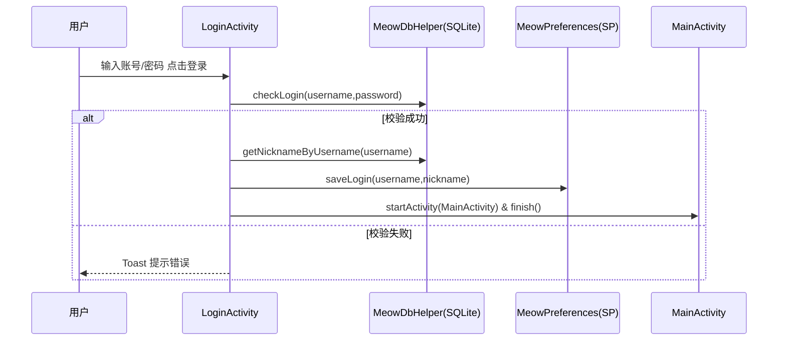
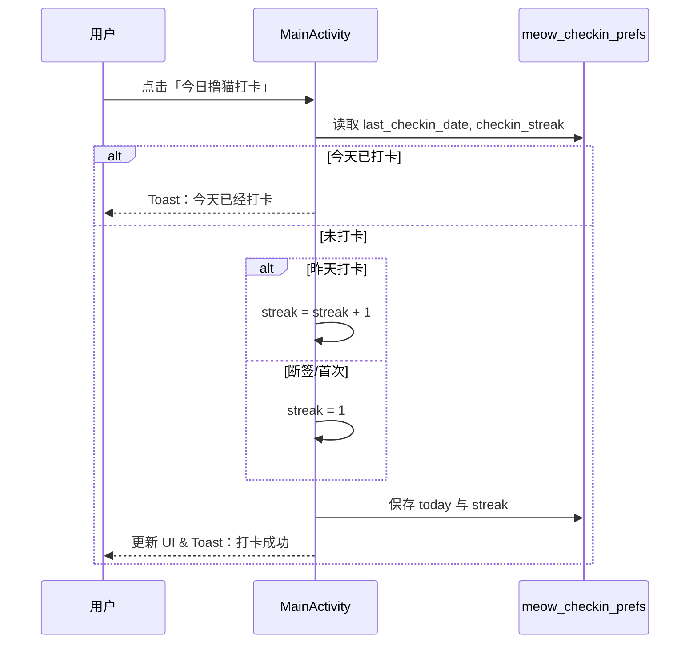

（标题均为小三号，宋体）（正文均为小四号，宋体，行距1.5倍）

# Meow：猫咪主题安卓客户端课程设计报告

> 说明：本文档为 Markdown 版本；若需提交 Word 版，可按“标题小三号宋体、正文小四号宋体、1.5 倍行距”套用样式。

**摘要：**本项目实现了一款猫咪主题的 Android 客户端应用（Meow），围绕“登录注册—首页导航—猫咪档案—云吸猫相册—喵音 FM—养猫百科—撸猫打卡”构建完整功能闭环。应用采用本地优先策略：用户数据使用 SQLite 持久化，登录态与打卡状态使用 SharedPreferences 存储；图片与音频资源内置于应用包中；百科内容通过 WebView 加载本地 HTML。界面使用 Material 组件与卡片式布局，适配 Edge-to-Edge。项目重点解决了多媒体播放的生命周期释放、打卡连续性判断与登录栈管理等问题，具备良好的可维护性与扩展空间。

**关键词：**Android；SQLite；SharedPreferences；RecyclerView；MediaPlayer；WebView；Material Design

## 一、需求分析

### 1.1 选题背景与问题描述

本课题选题为猫咪主题的安卓客户端，面向希望了解猫咪知识、浏览猫咪图片/音频并记录互动的用户。在日常场景中，猫咪科普内容分散于网页、视频与社交平台，信息碎片化、获取成本高；同时缺少轻量互动与“陪伴感”。因此需要在移动端提供一个集登录、科普、媒体娱乐和打卡于一体的轻量应用，解决零散信息、网络依赖强、互动性弱的问题。

### 1.2 需求与约束条件

要求与限制条件：
- 运行环境：Android 9.0（API 28）及以上，目标 API 36，适配 Edge-to-Edge；界面使用 Material 组件，风格统一。
- 数据与隐私：无后端服务；账号信息与业务状态均本地化。用户表存储在 SQLite（`MeowDbHelper`），登录态保存在 SharedPreferences（`MeowPreferences`）。密码目前为明文存储，作为课程设计的简化实现，后续可升级为加盐哈希。
- 资源与网络：图片（`res/drawable`）与音频（`res/raw`）全部内置；百科页面通过 WebView 加载本地 `assets/cat_wiki.html`。该 HTML 的样式使用 Tailwind CDN（`https://cdn.tailwindcss.com`），有网时排版更完整，离线时仍可阅读但样式可能降级。应用仅声明 `INTERNET` 权限。
- 交互约束：登录后才能进入主界面，未登录自动跳转登录页；多媒体播放需支持播放/暂停与状态切换，列表滚动流畅；打卡记录需持久化并正确处理“断签”。

### 1.3 目标与功能清单

本设计目标：
- 账号与安全：完成注册、登录、自动登录与退出登录流程；提供唯一用户名校验与基础输入校验。
- 首页导航与打卡：主界面展示当前用户昵称/账号；提供“猫咪档案”“喵音 FM”“养猫百科”“云吸猫相册”“撸猫打卡”等入口；支持连续打卡计数与提示。
- 猫咪档案：默认猫咪列表入库并展示；支持新增（末尾“＋添加”条目）、编辑（弹窗编辑名称/年龄/性格/描述/头像）、长按删除、按标题模糊搜索。
- 云吸猫相册：使用网格布局浏览本地猫咪图片，展示标题/描述，保证离线浏览体验。
- 喵音 FM：默认音频列表入库并展示；支持新增（上传音频）、编辑标题/描述（不可更换音频文件）、长按删除、按标题模糊搜索；并保留原有播放/暂停、进度条、快进/快退与状态高亮。
- 养猫百科：WebView 加载本地 HTML 科普页面，提供目录跳转与较丰富排版。
- 可靠性与可维护性：代码分包清晰（auth/cat/data/util）；播放器生命周期处理明确，避免资源泄漏。

---

## 二、总体设计

### 2.1 总体思路与架构

项目采用“本地优先（Local-first）+ 单 Activity 单功能页”的轻量架构：以 Activity 作为界面与交互入口，数据存储采用 SQLite + SharedPreferences，内容资源尽量内置，保证无后端条件下依然可完成主要功能闭环。

系统分层（自上而下）：
1. 表现层：Activity + XML 布局（负责 UI 渲染与事件响应）。
2. 业务/控制：Activity 内方法（登录校验、打卡计算、播放控制）。
3. 数据层：SQLite（用户信息）、SharedPreferences（登录态/打卡状态）、本地资源（图片/音频/HTML）。

### 2.2 功能模块划分（模块图）



### 2.3 代码组织与模块职责

代码位于 `app/src/main/java/com/justyn/meow/`，按功能分包：
- `auth/`：登录与注册（`LoginActivity`、`RegisterActivity`）。
- `cat/`：猫咪相关功能（`CatProfileActivity`、`CatFmActivity`、`CatWikiActivity`、`CatPicActivity`），包含 Adapter 与数据模型（`CatProfile`、`CatPic`、`FmTrack`）。
- `data/`：SQLite 数据库（`MeowDbHelper`）。
- `util/`：偏好设置工具类（`MeowPreferences`）。

资源组织：
- 布局：`app/src/main/res/layout/`（含各 Activity 与列表项 XML）。
- 图片：`app/src/main/res/drawable/`（背景、头像、相册图片等）。
- 音频：`app/src/main/res/raw/`（内置 `fm_*.m4a`，并支持用户从系统文件选择器上传本地音频）。
- 百科 HTML：`app/src/main/assets/cat_wiki.html`。

### 2.4 数据设计

#### 2.4.1 SQLite 数据库设计

数据库：`meow.db`，版本号：`2`，由 `MeowDbHelper` 维护，包含三张表：`user`、`fm_track`、`cat_profile`。

##### user 表（登录注册）

| 字段 | 类型 | 约束 | 说明 |
|---|---|---|---|
| id | INTEGER | PK, AUTOINCREMENT | 主键 |
| username | TEXT | NOT NULL, UNIQUE | 登录账号 |
| password | TEXT | NOT NULL | 登录密码（当前明文） |
| nickname | TEXT | NULL | 昵称（首页展示优先） |
| created_at | INTEGER | NULL | 注册时间戳 |

##### fm_track 表（喵音 FM）

| 字段 | 类型 | 约束 | 说明 |
|---|---|---|---|
| id | INTEGER | PK, AUTOINCREMENT | 主键 |
| title | TEXT | NOT NULL | 标题（搜索字段） |
| subtitle | TEXT | NULL | 描述 |
| audio_res_id | INTEGER | NULL | 内置音频（`R.raw.*`） |
| audio_uri | TEXT | NULL | 用户上传音频 URI（`content://...`） |
| created_at | INTEGER | NULL | 创建时间戳 |

##### cat_profile 表（猫咪档案）

| 字段 | 类型 | 约束 | 说明 |
|---|---|---|---|
| id | INTEGER | PK, AUTOINCREMENT | 主键 |
| title | TEXT | NOT NULL | 名称（搜索字段） |
| age | TEXT | NULL | 年龄 |
| personality | TEXT | NULL | 性格/品种 |
| description | TEXT | NULL | 描述 |
| avatar_res_id | INTEGER | NULL | 内置头像（`R.drawable.*`） |
| avatar_uri | TEXT | NULL | 用户选择头像 URI（`content://...`） |
| created_at | INTEGER | NULL | 创建时间戳 |

数据库升级策略：`onUpgrade()` 采用增量升级（`oldVersion < 2` 时仅新增 `fm_track` 与 `cat_profile` 表），不影响已有 `user` 数据。
默认数据策略：首次进入对应页面时，将 Activity 内“默认构造列表”一次性写入 SQLite，并用 SharedPreferences 的 seeded 标记避免重复写入。

#### 2.4.2 SharedPreferences 设计

- 登录态：`meow_prefs`（`MeowPreferences`）
  - `is_logged_in`：是否登录
  - `current_username`：当前账号
  - `current_nickname`：当前昵称
  - `seeded_fm`：是否已将默认喵音列表写入 SQLite
  - `seeded_cat_profile`：是否已将默认猫咪档案写入 SQLite
- 打卡：`meow_checkin_prefs`（`MainActivity`）
  - `last_checkin_date`：上次打卡日期（yyyy-MM-dd）
  - `checkin_streak`：连续打卡天数

### 2.5 关键流程设计（时序图）

#### 2.5.1 登录流程



#### 2.5.2 撸猫打卡流程



### 2.6 开发过程概述与问题处理

开发过程（简述）：
1. 创建工程（AGP 8.13.1，Java 17，minSdk 28 / targetSdk 36），引入 Material、RecyclerView 等依赖。
2. 完成登录/注册：SQLite 用户表 + SharedPreferences 登录态，支持自动登录与退出登录清栈。
3. 完成首页：卡片入口（档案/FM/百科/相册）+ 打卡模块；配色与背景图统一；适配 Edge-to-Edge。
4. 完成档案与相册：本地数据模型 + RecyclerView 列表/网格；加入条目点击反馈。
5. 完成喵音 FM：MediaPlayer 播放 + SeekBar 进度同步 + 快进/快退 + 播放状态高亮；处理 onStop 释放资源。
6. 完成百科：WebView 加载本地 HTML，支持目录跳转；识别离线样式依赖并记录改进方向。

主要问题与解决：
- 播放器资源泄漏：MediaPlayer 若不释放会占用系统音频资源；在 `CatFmActivity.onStop()` 统一释放并重置 UI。
- 播放进度同步：通过 Handler 定时更新进度条；用户拖动时用标记避免被刷新覆盖（后续可补全 SeekBar 回写逻辑）。
- 打卡“断签”判断：统一使用 `yyyy-MM-dd`，解析 Date 计算天数差判断是否为昨天。

---

## 三、系统实现

### 3.0 截图说明（建议）

课程报告通常需要关键页面截图（登录/注册/首页/档案/相册/FM/百科）与关键逻辑代码截图（登录校验、打卡计算、播放控制等）。若需补充截图，可在 Android Studio 运行到模拟器/真机后：
- 模拟器：使用系统截图按钮或 `Device Manager` 截图；
- 真机：系统截屏后导出图片；
并在文档中插入到对应小节位置即可。

### 3.1 登录与注册模块

页面：`activity_login.xml`、`activity_register.xml`；逻辑：`LoginActivity`、`RegisterActivity`；数据库：`MeowDbHelper`；登录态：`MeowPreferences`。

实现要点：
- 登录页启动时检查是否已登录，若已登录直接进入首页，避免重复输入账号密码。
- 注册流程包含必填校验、两次密码一致性校验、用户名唯一性校验（SQLite UNIQUE + 代码预检查）。
- 登录成功后保存登录态（账号与昵称），退出登录清除登录态并清空任务栈，防止返回到首页。

关键代码（登录成功后保存状态并跳转）：

```java
boolean ok = dbHelper.checkLogin(username, password);
if (ok) {
    String nickname = dbHelper.getNicknameByUsername(username);
    MeowPreferences.saveLogin(this, username, nickname == null ? "" : nickname);
    startActivity(new Intent(LoginActivity.this, MainActivity.class));
    finish();
}
```

### 3.2 首页导航与打卡模块

页面：`activity_main.xml`；逻辑：`MainActivity`。

实现要点：
- 首页卡片入口分别跳转到档案、喵音 FM、养猫百科、云吸猫相册页面。
- 用户展示：优先显示昵称，其次账号，兜底“神秘铲屎官”。
- 打卡逻辑：当天重复点击不累加；若昨天打卡则连续天数 +1；断签/首次则重置为 1，并持久化到 SharedPreferences。

关键代码（打卡断签处理与持久化）：

```java
if (today.equals(lastDate)) return;              // 今日已打卡
if (lastDate == null) streak = 1;                // 首次
else if (isYesterday(lastDate, today)) streak++; // 连续
else streak = 1;                                 // 断签重置
checkInPrefs.edit().putString(KEY_LAST_CHECKIN_DATE, today)
        .putInt(KEY_STREAK, streak).apply();
```

### 3.3 猫咪档案模块（RecyclerView 列表）

页面：`activity_cat_profile.xml`、列表项 `item_cat_profile_track.xml`；逻辑：`CatProfileActivity` + `CatProfileAdapter`；模型：`CatProfile`。

实现要点：
- 默认猫咪列表首次进入时入库（SQLite），之后列表从数据库读取并渲染。
- 顶部增加搜索框，按 `title`（猫名）进行模糊查询过滤。
- 列表末尾追加“＋添加猫咪”条目：点击打开弹窗新增；长按条目弹出操作菜单（编辑/删除）。
- 单击条目保留点击反馈（Toast）；编辑时支持修改名称/年龄/性格(品种)/描述，并可通过系统文件选择器更换头像（URI 持久化）。

### 3.4 云吸猫相册模块（RecyclerView 网格）

页面：`activity_cat_pic.xml`、网格项 `item_cat_pic.xml`；逻辑：`CatPicActivity` + `CatPicAdapter`；模型：`CatPic`。

实现要点：
- GridLayoutManager 2 列网格展示，提升图片浏览效率。
- 图片资源全部来自 `res/drawable`，保证离线可用与加载速度。

### 3.5 喵音 FM 模块（MediaPlayer + 进度控制）

页面：`activity_cat_fm.xml`、列表项 `item_fm_track.xml`；逻辑：`CatFmActivity` + `CatFmAdapter`；模型：`FmTrack`；资源：`res/raw/fm_*.m4a` 与用户上传音频 URI。

实现要点：
- 列表条目点击：若点击当前正在播放条目则停止并释放，否则切换到新条目播放。
- 列表末尾追加“＋添加喵音”条目：点击上传音频并新增；长按条目弹出操作菜单（编辑/删除）。
- 单击条目保持为播放/暂停；编辑时仅允许修改标题/描述，不允许更换音频文件（按需求约束）。
- 顶部搜索框按 `title` 模糊检索，过滤列表展示。
- 底部控制条：播放/暂停、快进/快退（10 秒步进）、SeekBar 进度显示。
- 生命周期：`onStop()` 统一释放播放器并重置列表/控件状态，避免后台播放与资源泄漏。

关键代码（播放切换与完成回调）：

```java
mediaPlayer = track.getAudioUri() != null
        ? MediaPlayer.create(this, Uri.parse(track.getAudioUri()))
        : MediaPlayer.create(this, track.getResId());
mediaPlayer.setOnCompletionListener(mp -> { releasePlayer(); resetPlaybackUi(); });
mediaPlayer.start();
```

### 3.6 养猫百科模块（WebView + 本地 HTML）

页面：`activity_cat_wiki.xml`；逻辑：`CatWikiActivity`；内容：`app/src/main/assets/cat_wiki.html`。

实现要点：
- WebView 加载本地 HTML：

```java
webView.loadUrl("file:///android_asset/cat_wiki.html");
```

- 百科内容为本地文件，但样式依赖 Tailwind CDN；因此“内容离线可读”，但“样式完全离线一致”仍有改进空间（可将 CSS 本地化）。

### 3.7 构建与运行说明

常用命令（在项目根目录执行）：
- `./gradlew assembleDebug`：编译并生成 Debug APK。
- `./gradlew installDebug`：安装到连接的设备/模拟器。
- `./gradlew lint`：运行 Android Lint。

构建参数（与工程配置一致）：
- `minSdkVersion`：28；`targetSdkVersion`：36；`compileSdkVersion`：36
- Java：17

### 3.8 功能验证（手工测试用例）

本项目当前未编写自动化测试用例（`app/src/test/` 与 `app/src/androidTest/` 为空），主要通过手工测试验证：

| 用例 | 步骤 | 期望结果 |
|---|---|---|
| 注册成功 | 输入新账号/密码/确认密码，提交 | 提示注册成功并返回登录页 |
| 注册失败-重复账号 | 使用已存在账号注册 | 提示账号已存在 |
| 登录成功 | 输入正确账号密码 | 进入首页，显示昵称/账号 |
| 自动登录 | 已登录后重启 App | 直接进入首页 |
| 退出登录 | 首页点击“退出登录” | 清除登录态，回到登录页且不可返回 |
| 打卡连续 | 连续两天点击打卡 | 连续天数 +1 |
| 打卡重复 | 当天重复点击打卡 | 提示已打卡，连续天数不变 |
| FM 播放 | 点击某条音频 | 播放开始，列表状态更新，进度条移动 |
| FM 切换 | 播放中点击另一条 | 自动切换播放，旧播放器释放 |
| FM 后台 | 播放中切后台或退出页面 | onStop 释放播放并重置 UI |
| 相册浏览 | 进入云吸猫，滚动列表 | 网格滚动流畅，点击 Toast 提示 |
| 百科阅读 | 进入养猫百科 | WebView 正常加载本地页面（有网时样式更完整） |

---

## 四、结论与心得

### 4.1 结论

本课程设计完成了一个猫咪主题的安卓客户端应用，覆盖“账号体系 + 首页导航 + 档案/相册/FM/百科 + 打卡”核心功能，并实现本地化数据持久化与较统一的 Material 风格界面。整体结构清晰、功能闭环完整，满足无后端条件下的课程设计要求。

### 4.2 调试中发现的问题与解决办法

1. **MediaPlayer 资源释放与状态一致性**：初期切换页面后仍可能占用音频资源。通过在 `CatFmActivity.onStop()` 调用释放方法，并统一重置 UI 解决。
2. **播放进度刷新与用户拖动冲突**：定时刷新会覆盖用户拖动操作。采用 Handler 定时刷新 + 用户拖动标记规避冲突（后续可完善 SeekBar 拖动后 `seekTo`）。
3. **打卡日期计算**：仅用字符串比较无法判断“昨天”。统一日期格式并解析为 Date 计算天数差解决。
4. **退出登录后返回栈问题**：若不清栈可能返回首页。通过设置 `Intent.FLAG_ACTIVITY_NEW_TASK | Intent.FLAG_ACTIVITY_CLEAR_TASK` 解决。

### 4.3 收获与不足

收获：
- 熟悉 Activity 生命周期与页面跳转栈管理，掌握登录态持久化（SharedPreferences）的常用实现方式。
- 熟悉 RecyclerView + Adapter 的列表/网格实现与条目复用机制。
- 掌握 MediaPlayer 的基本播放控制与资源释放要点，理解“业务状态与 UI 状态同步”的重要性。
- 熟悉 WebView 加载本地 assets 资源的方式及其在课程设计中的价值。

不足与后续改进方向：
- **账号安全**：密码目前明文存储，可升级为加盐哈希（PBKDF2/BCrypt）并结合 Android Keystore。
- **数据层可维护性**：可引入 Room 替代 SQLiteOpenHelper，实现更清晰的数据访问层与迁移策略。
- **百科离线一致性**：将 Tailwind CDN 改为本地 CSS 或内联样式，确保完全离线时排版一致。
- **功能扩展**：档案可增加详情页/收藏；相册可增加全屏预览与分享；打卡可增加日历视图与提醒通知。

---

## 五、致谢

感谢授课老师在 Android 基础、UI 设计与本地存储等方面的指导；感谢同学在需求讨论与交互建议上的帮助；也感谢 AndroidX、Material 等开源组件与文档支持，使本项目能够顺利完成。
